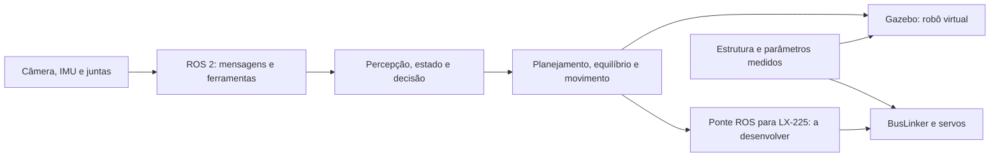

# Gaia — humanoide para futebol de robôs

Este é o ponto de encontro da equipe **Gaia** para desenvolver um humanoide com servos **LX-225**, estudar o **ROBOTIS OP3** e avançar rumo à autonomia na **CBR, categoria Humanoid**.

**Novo no GitHub?** Comece pelo [guia de navegação](docs/primeiros-passos-github.md). Você pode ler tudo pelo navegador: clique nos links e nas pastas; o README é a página inicial de cada área.

## Escolha sua área

| Área | Comece aqui | O que você encontrará |
| --- | --- | --- |
| Programação | [Trilha de programação](docs/programacao/README.md) | Python, ROS 2, simulação, sensores e autonomia |
| Estrutura | [Trilha de estrutura](docs/estrutura/README.md) | CAD do servo LX-224/LX-225, suportes, fabricação e modelo do robô |
| Eletrônica | [Trilha de eletrônica](docs/eletronica/README.md) | BusLinker V2.5/V3, alimentação, drivers e diagnóstico |
| Competição | [CBR Humanoid](docs/competicao/README.md) | Regulamentos, limitações e requisitos pendentes |

## Roteiro para entrar na equipe

1. Leia o [guia GitHub](docs/primeiros-passos-github.md): baixar arquivos, acompanhar alterações e registrar dúvidas.
2. Conheça os [objetivos e etapas da autonomia](docs/simulacao/autonomia.md).
3. Para programação ROS, prepare o computador pelo repositório separado [Gaia — Ubuntu 24.04 e ROS 2 Jazzy](https://github.com/Pedronsjaja/gaia-ros2-ubuntu24). Ele explica dual boot e máquina virtual.
4. Volte aqui e faça o [laboratório OP3 no Gazebo Harmonic](docs/simulacao/instalacao-e-laboratorio.md): carregar o modelo, comandar a cabeça, ler câmera e IMU.
5. Para trabalho físico, siga primeiro a [instalação da bancada com um servo](docs/instalacao.md).
6. Antes de fechar dimensões ou comprar sensores, consulte a [matriz de requisitos da CBR](docs/competicao/matriz-requisitos.md).

## Acesso rápido

| Quero… | Abrir |
| --- | --- |
| Instalar e usar BusLinker V2.5 ou V3 | [Instalação](docs/instalacao.md) · [Comandos Python](docs/uso.md) |
| Datasheets, manuais e esquemas | [Documentação técnica](docs/datasheets/README.md) |
| Softwares Hiwonder e drivers USB | [Downloads e instalação](docs/softwares-e-drivers.md) |
| Resolver erros de comunicação/movimento | [Solução de problemas](docs/solucao-de-problemas.md) |
| CAD e suportes para impressão | [Catálogo mecânico](hardware/README.md) |
| Simular no Linux | [Simulação](docs/simulacao/README.md) |
| Entender como criar o modelo Gaia | [CAD → URDF → simulação](docs/simulacao/modelo-gaia.md) |
| Integrar LX-225 | [Arquitetura de atuadores](docs/gaia_lx225.md) |
| Joystick e OLED ESP32-S3 | [Guia do joystick](docs/joystick.md) |
| Consultar regras e documentos locais | [Competição e fontes](docs/competicao/fontes.md) |

## O que já existe e o que ainda falta

| Parte | Estado |
| --- | --- |
| Bancada Python LX-225 | Comunicação, sensores, gráficos, IDs e calibração; testes de software com serial simulada |
| BusLinker | Programas independentes [V2.5](buslinker_v2_5.py) e [V3](buslinker_v3.py), documentação e diagnóstico |
| Estrutura | CAD compartilhado LX-224/LX-225 e suportes catalogados em [hardware](hardware/README.md) |
| Simulação | Adaptador didático OP3 com base presa, controladores e sensores; conferir [validação e versões](docs/simulacao/referencias.md) |
| Modelo completo Gaia | Ainda precisa de montagem, massas, inércias, eixos e limites medidos |
| Autonomia | Plano de evolução; percepção de futebol, equilíbrio, marcha e ponte ROS/LX-225 ainda precisam ser implementados |
| CBR | Categoria Humanoid escolhida; subcategoria, edição e regulamento aplicável pendentes |

O OP3 é referência de estudo. Seus atuadores DYNAMIXEL, massas e controladores não equivalem automaticamente ao Gaia com LX-225. O laboratório inicial suspende o robô para aprender comandos e sensores; ele não demonstra marcha nem habilitação para competir.

## Como as partes se conectam



O **Gazebo** simula física e sensores. O **ROS 2** conecta programas, organiza mensagens e oferece ferramentas de inspeção. A equipe desenvolve os algoritmos que percebem o jogo e escolhem ações. Veja os [marcos de autonomia](docs/simulacao/autonomia.md).

## Onde estão os arquivos?

```text
docs/
  primeiros-passos-github.md
  programacao/         # Trilha de software
  estrutura/           # Trilha mecânica
  eletronica/          # Trilha eletrônica
  simulacao/           # Instalação, modelo e autonomia
  competicao/          # CBR, fontes e matriz de requisitos
  datasheets/          # Manuais e esquemas
hardware/              # CAD e suportes originais, com catálogo
ros2/gaia_op3_sim/      # Pacote do laboratório virtual
simulation/op3.repos   # Revisão fixa do modelo ROBOTIS
firmware/              # Diagnóstico joystick/OLED
tests/                 # Testes dos scripts de bancada
tools/                 # Diagnóstico e geração dos programas
buslinker_v2_5.py       # Programa independente V2.5
buslinker_v3.py         # Programa independente V3
```

Os arquivos 3D do humanoide ficam neste repositório, junto da documentação e das interfaces mecânicas. O ambiente Ubuntu/ROS 2 fica em outro repositório porque serve a vários projetos da equipe. Baixe a montagem CAD com suas dependências, conforme o catálogo.

## Como colaborar

Use **Issues** para dúvidas, defeitos e tarefas; informe sua área, objetivo, revisão, passos e evidências. Para propor mudanças, crie uma branch e uma **Pull Request**. O [guia GitHub](docs/primeiros-passos-github.md) explica esses termos e mostra o caminho.

Validação da bancada, sem conectar servos:

```powershell
python -m unittest discover -s tests -v
```

Os programas autônomos são gerados a partir de `servo_testbench.py`, `bench_tools.py` e `test_servos.py` por `python tools/build_standalone.py`. Testes de software não substituem ensaios elétricos, mecânicos ou a inspeção da competição.
