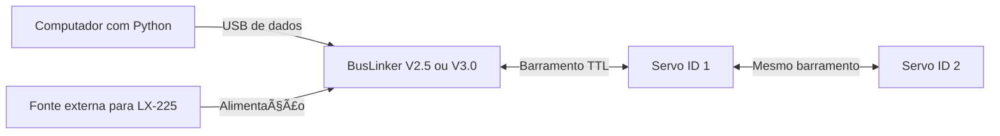

# Gaia — servos LX-225, BusLinker e peças mecânicas

Ferramentas de bancada dos atuadores do humanoide **Gaia**: controle Python de servos Hiwonder LX-225 com BusLinker V2.5 ou V3.0, leitura de sensores, gráficos, configuração de IDs, calibração e arquivos mecânicos.

**Comece com um único servo:** confirme a comunicação, teste um movimento pequeno e só depois monte o barramento com vários IDs.

## Encontre o que você precisa

| Quero… | Abrir |
| --- | --- |
| Instalar do zero e identificar a porta USB | [Tutorial de instalação](docs/instalacao.md) |
| Baixar datasheets, manuais e esquemas | [Documentação técnica V2.5, V3 e LX-225](docs/datasheets/README.md) |
| Instalar software Hiwonder ou driver USB | [Softwares e drivers](docs/softwares-e-drivers.md) |
| Ler sensores, mover, gerar gráficos ou calibrar | [Manual dos comandos Python](docs/uso.md) |
| Resolver erros de comunicação ou movimento | [Solução de problemas](docs/solucao-de-problemas.md) |
| Baixar CAD LX-224/LX-225 e suportes | [Catálogo mecânico](hardware/README.md) |
| Integrar os atuadores no humanoide | [Arquitetura Gaia](docs/gaia_lx225.md) |
| Montar joystick e display ESP32-S3 | [Guia do joystick](docs/joystick.md) |

## Como funciona



A **BusLinker** conecta o computador ao barramento. O **driver USB** faz aparecer a porta COM no sistema. Os **scripts Python** enviam comandos pela porta; cada servo tem um ID. O LX-225 recebe comandos seriais, não pulsos de um controlador de servo PWM convencional.

**Alimente o LX-225 com 6–8,4 V.** A corrente de travamento informada é 4 A por servo: considere picos simultâneos, cabos e conectores ao dimensionar a alimentação. A tensão máxima aceita pela placa não é a tensão máxima do servo. [Especificações Hiwonder](https://www.hiwonder.com/products/lx-225).

## Primeiro teste no Windows

Você precisa de uma BusLinker, um LX-225, cabo de servo, cabo USB **de dados**, fonte apropriada e Python. O [tutorial completo](docs/instalacao.md) explica as conexões e a instalação.

1. Baixe o repositório em **Code → Download ZIP** e extraia tudo, ou clone pelo endereço mostrado em **Code**. Abra um terminal na pasta deste README.
2. Crie o ambiente e instale as dependências:

   ```powershell
   python -m venv .venv
   .\.venv\Scripts\python.exe -m pip install -r requirements.txt
   ```

3. Com a alimentação desligada, conecte um servo e confira polaridade, conector e seleção USB da sua revisão. Ligue a fonte e conecte o USB. Feche os outros programas que usam a serial e identifique a porta:

   ```powershell
   .\.venv\Scripts\python.exe -m serial.tools.list_ports -v
   ```

4. Substitua `COM7` pela porta identificada e execute **apenas o comando da sua placa**:

   ```powershell
   # BusLinker V2.5 — somente leitura
   .\.venv\Scripts\python.exe buslinker_v2_5.py --port COM7 --scan
   # BusLinker V3.0 — somente leitura
   .\.venv\Scripts\python.exe buslinker_v3.py --port COM7 --scan
   ```

A busca percorre IDs de 0 a 253 e mostra os que responderam, com posição, tensão e temperatura. Se nada responder, siga o [diagnóstico](docs/solucao-de-problemas.md). IDs duplicados não permitem contar separadamente os servos físicos.

5. Confira o percurso mecânico antes de mover. Exemplo para **ID 1 e V3**:

   ```powershell
   .\.venv\Scripts\python.exe buslinker_v3.py --port COM7 --ids 1 --move --delta 5 --seconds 2
   ```

Isso solicita **+5° a partir da posição atual**, em 2 segundos, sem retorno automático. O teste verifica modo de posição, limites e tensão; pode habilitar torque. `Ctrl+C` tenta parar o servo, mas uma falha de comunicação pode impedir a parada. Fechar o programa não desliga o torque.

## Qual arquivo executar?

| Placa | Arquivo autônomo | Classe para importar |
| --- | --- | --- |
| BusLinker V2.5 | [buslinker_v2_5.py](buslinker_v2_5.py) | `BusLinkerV2_5` |
| BusLinker V3.0 | [buslinker_v3.py](buslinker_v3.py) | `BusLinkerV3` |

Cada arquivo inclui comunicação, menu, gráficos, IDs e calibração. Pode ser copiado sozinho, desde que `pyserial` e `matplotlib` estejam instalados. Os dois usam o protocolo LX-225 a **115200 baud**. O nome V3 não ativa protocolos de outros modelos de servo.

Com o ambiente virtual ativo, exemplos para V3:

```powershell
# Menu de consulta e movimento solicitado pelo usuário
python buslinker_v3.py --interactive --port COM7 --ids 1
# Gráficos e CSV, sem movimentar
python buslinker_v3.py monitor --port COM7 --ids 1 --duration 30 --live
# Nome local da junta; não muda o ID físico
python buslinker_v3.py add-id --id 1 --name joelho_esquerdo
```

O monitor salva dados em `resultados/`; os nomes ficam em `servos.json`. Ambos são locais e ignorados pelo Git. Veja [uso avançado](docs/uso.md) para troca de ID físico, calibração, offset e sincronização.

## CAD e suportes

O [catálogo mecânico](hardware/README.md) reúne o CAD compartilhado LX-224/LX-225 informado pelo mantenedor, a montagem SolidWorks e os suportes em Inventor, STEP e STL.

- **Montagem do servo:** [CAD LX-224/LX-225](hardware/cad/servo-lx224-lx225/).
- **Imprimir suportes:** [STL](hardware/suportes/gaia-3d/STL/).
- **Adaptar em CAD:** [STEP](hardware/suportes/gaia-3d/STEP/).
- **Peças nativas:** [Inventor Gaia 3D](hardware/suportes/gaia-3d/IPT/) e [peças LX-225](hardware/suportes/pecas-lx225/).

Confira unidades, furos, folgas e percurso antes de fabricar. A equivalência do CAD é uma referência mecânica do projeto; as especificações elétricas utilizadas são as do LX-225.

## Organização

```text
├── README.md                    # Comece aqui
├── requirements.txt             # Dependências Python
├── buslinker_v2_5.py             # Programa completo para V2.5
├── buslinker_v3.py               # Programa completo para V3.0
├── servo_testbench.py            # Fonte do driver compartilhado
├── bench_tools.py               # Monitoramento, cadastro e calibração
├── test_servos.py                # Interface de bancada
├── docs/                        # Instalação, uso e problemas
│   └── datasheets/               # Manuais, esquemas e fontes oficiais
├── hardware/                    # CAD e suportes, com catálogo
├── firmware/joystick_diagnostic/ # Diagnóstico do joystick/OLED
├── tests/                       # Testes com serial simulada
└── tools/                       # Diagnóstico e geração dos programas
```

## Desenvolvimento e limites

O projeto é uma bancada de atuadores. Marcha, equilíbrio e segurança do humanoide completo dependem da integração. A velocidade exibida é calculada entre leituras de posição; corrente e torque não são medidos pelo driver. O firmware do joystick testa botões e OLED e ainda não comanda servos.

Para validar sem hardware:

```powershell
python -m unittest discover -s tests -v
```

Os testes simulados verificam software e protocolo, sem certificar o funcionamento elétrico/mecânico. Para mudar os programas autônomos, edite `servo_testbench.py`, `bench_tools.py` e `test_servos.py`, depois execute `python tools/build_standalone.py`.

Ao relatar um problema, inclua revisão da placa, modelo e IDs dos servos, sistema operacional, comando, mensagem completa e alimentação usada.
