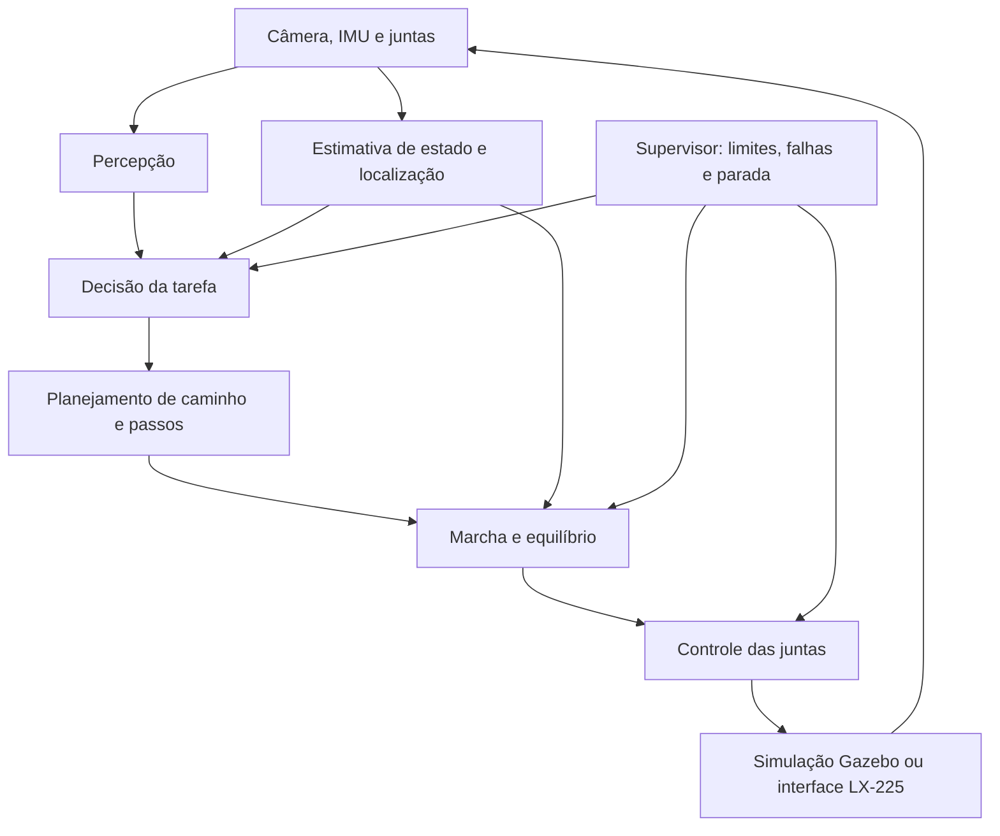

# ROS 2 e o caminho do Gaia até a autonomia

[Índice](README.md)

Autonomia significa o robô perceber o ambiente, estimar seu estado, escolher uma ação e executá-la com feedback. ROS 2 fornece comunicação e ferramentas para conectar essas partes; os algoritmos e os critérios de segurança precisam ser desenvolvidos e avaliados pela equipe.

## Arquitetura proposta

O mesmo contrato de mensagens pode ser usado na simulação e no hardware, com interfaces diferentes na camada inferior. Isso facilita reaproveitar software, mas não garante desempenho igual: atrasos, folgas, atrito e limites reais precisam ser medidos.

## Responsabilidades do ROS 2

| Parte | Papel | Exemplo de interface proposta |
| --- | --- | --- |
| Aquisição | Publicar dados com timestamp/referencial | Image, CameraInfo, Imu, JointState |
| TF/robot_state_publisher | Relacionar sensores e segmentos | Árvore de transformações |
| Percepção | Detectar objeto, pessoa ou obstáculo | Detecções com confiança |
| Estimativa | Combinar IMU, juntas e percepção | Pose, velocidade e incerteza |
| Decisão | Escolher entre observar, mover e parar | Máquina de estados ou árvore de comportamento |
| Planejamento | Definir caminho e apoios dos pés | Objetivos/planos com limites |
| Controle | Transformar objetivos em trajetórias | JointTrajectory/FollowJointTrajectory |
| Supervisão | Identificar falhas e limitar atuação | Estado de falha, timeout e parada |
| Registro | Reproduzir dados para comparação | rosbag2 e métricas do experimento |

Essas são **interfaces propostas**, não todos os nós já implementados. O laboratório atual fornece modelo, controle de juntas, câmera, IMU, TF das juntas e relógio simulado.

## Objetivos por etapa

Os números abaixo são metas iniciais de laboratório, a ajustar com resultados; não são certificação de segurança.

| Marco | Objetivo | Evidência para avançar | Frente principal |
| --- | --- | --- | --- |
| M0 — ambiente | Todos conseguem executar ROS | Talker/listener e RViz em cada PC | Infraestrutura |
| M1 — simulação | OP3 responde a um comando | Controladores active, cabeça acompanha alvo, sensores recebem dados | Software/controle |
| M2 — representação Gaia | Uma junta Gaia é reproduzida | CAD, zero, limites, massa e trajetória comparados com a bancada | Mecânica/eletrônica |
| M3 — postura | Sustentar postura em simulação livre | Registrar 30 s sem queda, erros e esforço; repetir com perturbações definidas | Controle |
| M4 — locomoção | Dar passos e parar sob comando | Percurso curto repetido, taxa de quedas e estabilidade de parada | Controle |
| M5 — percepção | Detectar alvo/obstáculo | Vídeos/dados anotados, falsos positivos e latência medidos | Visão |
| M6 — tarefa simples | Observar e orientar a cabeça ao alvo | Alvo encontrado/perdido tratado sem movimentos ilimitados | Visão/software |
| M7 — autonomia móvel | Ir a um objetivo com supervisão | Planejamento, localização e marcha integrados; parar ao perder condições | Integração |
| M8 — transferência | Repetir em hardware de forma gradual | Uma junta, conjunto suspenso e só depois robô completo | Todas |

A equipe pode estudar percepção antes de concluir marcha. Autonomia móvel exige que as duas frentes se encontrem.

## O que aproveitar do OP3

Estudem sua cadeia de juntas, separação de módulos, cinemática, movimentos e organização de sensores. As bibliotecas estão no [mapa de referências](referencias.md). Os parâmetros do OP3 não devem ser copiados para o Gaia sem adaptação: motores DYNAMIXEL, geometria e inércia são diferentes.

O **Nav2** pode ajudar em planejamento e navegação quando houver localização, sensores, TF e uma interface de locomoção compatível. Ele não cria marcha bípede nem resolve sozinho equilíbrio ou colocação dos pés. Da mesma forma, instalar ROS 2, MoveIt ou uma rede neural não torna o humanoide autônomo. [Documentação Nav2](https://docs.nav2.org/).

## Simulação, relógio e avaliação

Use `use_sim_time:=true` nos nós que devem seguir `/clock`. Ao pausar Gazebo, o tempo simulado para. Taxas reais podem ser menores quando CPU/GPU não acompanham o cenário; registre essa diferença para não interpretar atraso de computador como falha de controle.

Avaliem erro de posição, latência, taxa de sensores, perda de mensagens, quedas, distância percorrida e taxa de sucesso da tarefa. Comparem vários ensaios com mesma revisão de código/modelo/cenário. Os ganhos ideais do simulador não demonstram capacidade térmica ou de torque do servo real.

## Limites antes de atuar no robô real

A bancada LX-225 já fornece leitura e movimento de teste, mas ainda não implementa um controlador ROS de corpo inteiro. É necessário mapear juntas/IDs, calibrar zeros/sentidos, medir a capacidade do barramento, tratar falhas e definir uma parada física. Linux comum e ROS 2, por si só, não garantem prazos de controle de equilíbrio.

A transição recomendada é: **junta simulada → junta real sem carga → conjunto suspenso → postura supervisionada → marcha → tarefa autônoma**.

Referências: [conceitos ROS 2](https://docs.ros.org/en/jazzy/Concepts.html), [ROS 2 control](https://control.ros.org/jazzy/), [arquitetura e pacotes OP3](https://emanual.robotis.com/docs/en/platform/op3/robotis_ros_packages/), [simulação OP3](https://emanual.robotis.com/docs/en/platform/op3/simulation/).

## Aplicar ao futebol da CBR

O objetivo de competição é **CBR Humanoid**. Depois do laboratório introdutório, planeje percepção de bola/traves/linhas, localização, estados do GameController, aproximação, alinhamento, chute e recuperação de queda. A arquitetura deve tolerar perda de rede e respeitar penalidades.

Veja as [limitações e pendências do regulamento](../competicao/README.md) antes de escolher sensores e a [matriz de requisitos](../competicao/matriz-requisitos.md) para dividir responsabilidades. Pose perfeita da simulação serve para medir erros; não deve substituir a percepção embarcada na solução competitiva.
