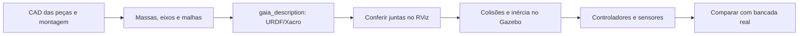

# Como levar o Gaia para dentro do simulador

[Índice](README.md) · [Catálogo CAD](../../hardware/README.md)

O OP3 é nossa referência inicial. Para simular o Gaia, precisamos construir sua descrição física; trocar apenas a aparência do OP3 não produz um modelo fiel.

## Dados que a mecânica precisa entregar

| Por corpo rígido | Por junta |
| --- | --- |
| Nome e arquivo de malha | Nome, corpo pai e corpo filho |
| Massa em kg | Tipo e eixo de rotação |
| Centro de massa em metros | Posição/orientação de montagem |
| Tensor de inércia em kg·m² | Limites mecânicos em radianos |
| Geometria visual e de colisão | Zero, sentido positivo e ID do servo |
| Referencial de origem | Velocidade e esforço admissíveis medidos/especificados |

Os [CADs atuais](../../hardware/README.md) incluem servo e suportes; eles ainda não são uma montagem cinemática completa do humanoide. A equipe deve definir número e nomes finais das juntas, dimensões e sensores.

## Fluxo CAD → ROS → física



1. **Monte uma junta antes do humanoide completo.** Exporte as malhas do suporte e servo; mantenha o arquivo nativo para editar.
2. **Padronize unidades.** ROS usa metros e radianos. Um STL exportado em milímetros precisa ser convertido ou usar escala 0.001; não aplique a conversão duas vezes.
3. **Escolha os referenciais.** Marque o centro do eixo e a direção positiva. O `origin` da junta relaciona pai e filho; não é apenas a posição visual do STL.
4. **Crie gaia_description.** O pacote terá `urdf/`, `meshes/`, `launch/` e configuração RViz. Ainda não existe uma descrição completa do Gaia neste repositório.
5. **Defina links e joints no URDF.** Use Xacro para repetir componentes. Visual é aparência; collision pode ser geometria simplificada; inertial é massa/inércia.
6. **Teste no RViz.** Mova uma junta pelo joint_state_publisher_gui e confira eixo, sentido, limite, escala e cadeia pai/filho, sem simulador físico.
7. **Inclua ros2_control e Gazebo.** Reaproveite a organização do laboratório, substituindo nomes, limites, massas e sensores pelos valores Gaia. Não basta apontar o launch para um novo STL.
8. **Valide sob suporte virtual.** Compare posições e trajetórias com uma junta da bancada real antes de liberar a base.

Exemplo meramente estrutural:

```xml
<joint name="joelho_esquerdo_pitch" type="revolute">
  <parent link="coxa_esquerda"/>
  <child link="canela_esquerda"/>
  <!-- origin, axis, limit: preencher com dados medidos da montagem -->
</joint>
```

Esse fragmento está incompleto de propósito: não é um URDF pronto para executar. Não invente massas ou limites só para fazer o simulador aceitar o arquivo.

## Ponte com LX-225

O driver atual trabalha com IDs e ângulos absolutos em graus. ROS usa nomes de juntas e radianos. Para acoplamento direto, uma conversão possível é:

`ângulo_servo_graus = zero_servo_graus + sentido × radianos_junta × 180/π`

O sentido é +1 ou −1 e o zero deve ser calibrado. Reduções e transmissões exigem sua própria relação. Confira limites mecânicos **e** faixa do servo após converter. Não confunda offset eletrônico com zero geométrico do URDF.

A futura interface de hardware deverá ler posição/tensão/temperatura, publicar estado e aceitar alvos com limites, timeouts e comportamento de parada. Um processo deve possuir o barramento serial; múltiplos nós não devem abrir a mesma COM.

## Critérios para aceitar um modelo Gaia

- Todos os links têm escala e referenciais conferidos.
- Juntas obedecem aos limites, sentidos e IDs documentados.
- Massa total e centros de massa conferem com montagem/pesagem.
- Inércias são fisicamente consistentes, sem valores nulos usados como atalho.
- Não há colisões impossíveis na postura inicial.
- Modelo preso segue trajetórias pequenas; modelo livre só é avaliado com estratégia de equilíbrio.
- Diferenças entre ensaio real e simulado são registradas.

Fontes de estudo: [hardware/CAD OP3](https://emanual.robotis.com/docs/en/platform/op3/hardware/#hardware), [tutorial URDF ROS 2](https://docs.ros.org/en/jazzy/Tutorials/Intermediate/URDF/URDF-Main.html), [unidades e coordenadas REP-103](https://www.ros.org/reps/rep-0103.html), [gz_ros2_control](https://control.ros.org/jazzy/doc/gz_ros2_control/doc/index.html).
